# #CTFFriday 2020JulyWeek1 

* Date: 3rd July 2020
* Time: 2:00 to 3:00 PM

## Organized By

   

 <span style="color:red"> Net Square Solutions Pvt. Ltd.</span>                              

## About Me

Hi,

I am [Smit Patel](https://twitter.com/smit_2307) and I am currently working as a Security Analyst at  [Net Square Solutions Pvt. Ltd.](https://net-square.com) I participated in ctf as ```sk```

## Overview

This ```CTF``` is build by [Prachi Karad](https://twitter.com/arun_prachi). There were 5 challenges based on MISC.

<h3>Challenge-1</h3>

**Hints :**
* Do They Love You Or The MASK You Put On Everyday….??

* "Walk" like a hacker.

**Flag 1 :** 50 Points

**Description :**

* This Challenge is based on steganography. For this Challenge one URL is given. 

 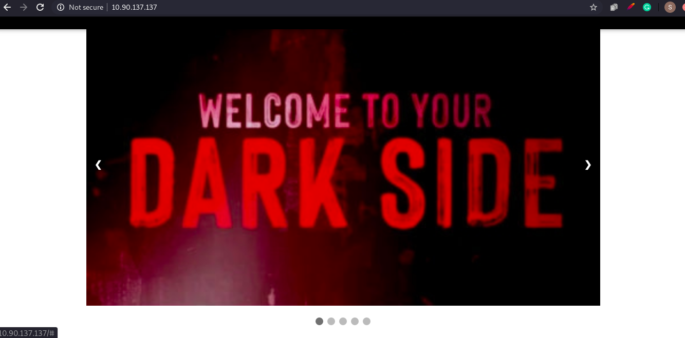  

* From the hint i got the idea that i have to find something related to mask. For that i opened page source code and founded one image named `mask.jpg`.

 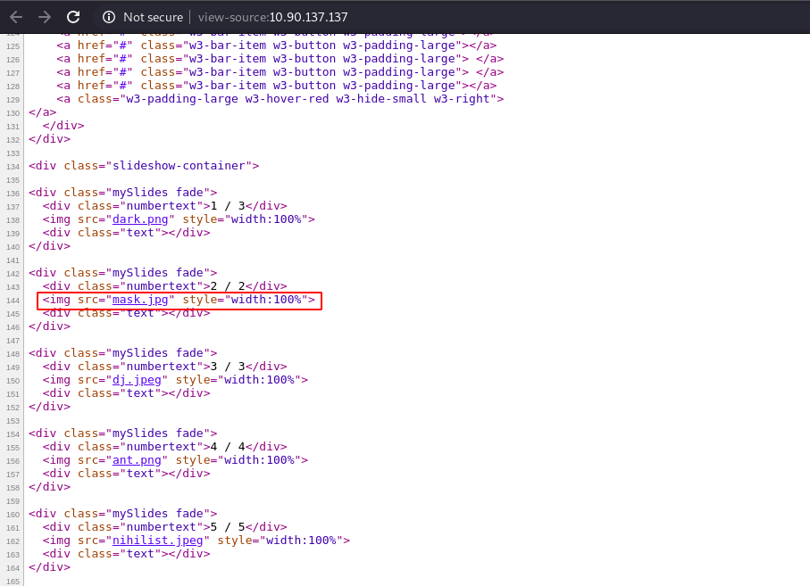

* Downloaded that image and tried to decode it. 

 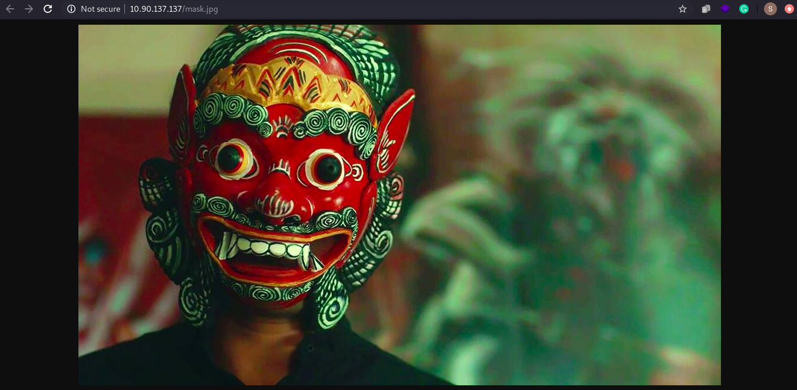

* From the second hint i got the idea for extracting image. After that image was extrected using `binwalk`. For that use following command: `binwalk -D='.*' mask.jbg`.

 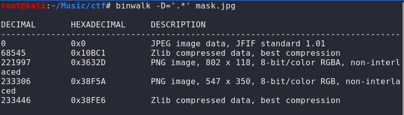

* That command created one `_mask.jpg.extracted` folder in the directory.

 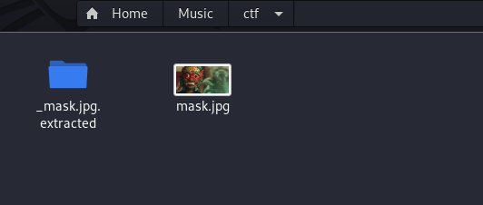

* opened that folder.

 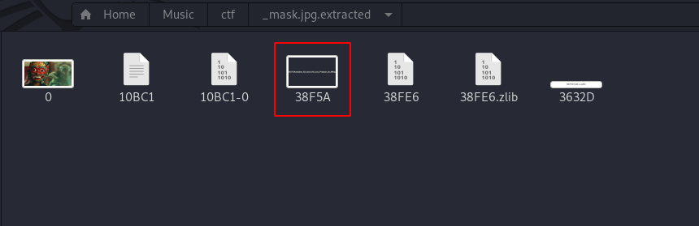

* And got the first flag.

 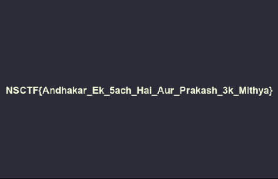

* **`NSCTF{Andhakar_Ek_5ach_Hai_Aur_Prakash_3k_Mithya}`**

<h3>Challenge-2</h3>

**Hints :**
* Go and search for a nihilist, Ask Nikhil to come back.

* Look at the metadata of image.

**Flag 2 :** 50 Points

**Description :**

* From the hint i got the idea that i have to search for nihilist. For that i again visited the page source code and i found `nihilist.jpeg` image.

 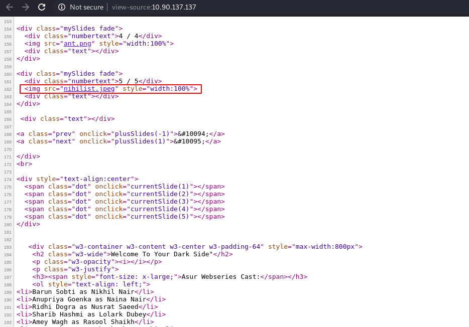

* Opened that image and downloaded that image.

 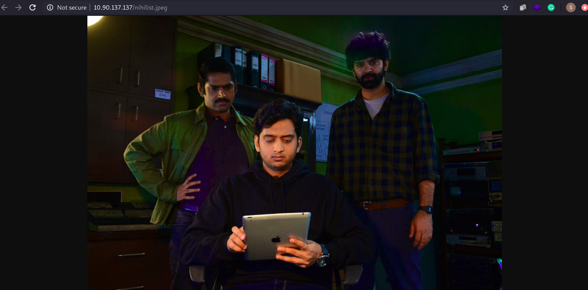

* From the second hint i got the idea that i have to check meta data of the image. For that i used online meta data viewer tool and found some numerical data at file comment.

 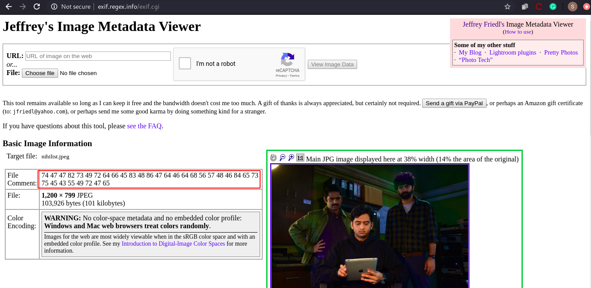

* To decode that numerical data i visited cryptii and used `nihilist cipher` and entered `nikhil` as a key and i got the second flag.

 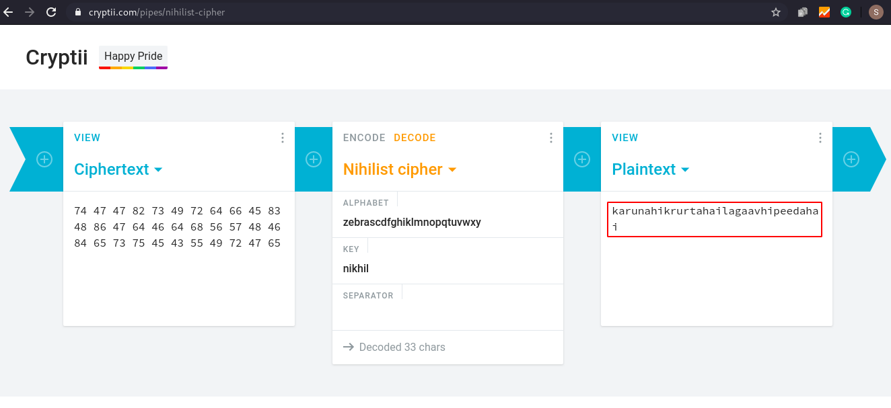

* **`NSCTF{karunahikrurtahailagaavhipeedahai}`**

<h3>Challenge-3</h3>

**Hints :**
* dj Will guide you to the right path to grab “ASUR”.

* Use CWE 22.

**Flag 3 :** 50 Points

**Description :**

* From the hint i got the idea that `Path Traversal` vulnerability used in this challenge and `dj` is the vulnerable parameter. As shown in the picture you can view all the system files by exploiting the vulnerability. From the hint i got the idea that i have to look for home directory of `asur` user so i checked the files(Including the hidden files) which was presented in home directory.

 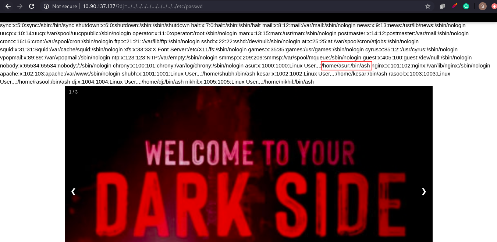

* Flag.txt file was present in home directory of asur and from that file i got the third flag.

 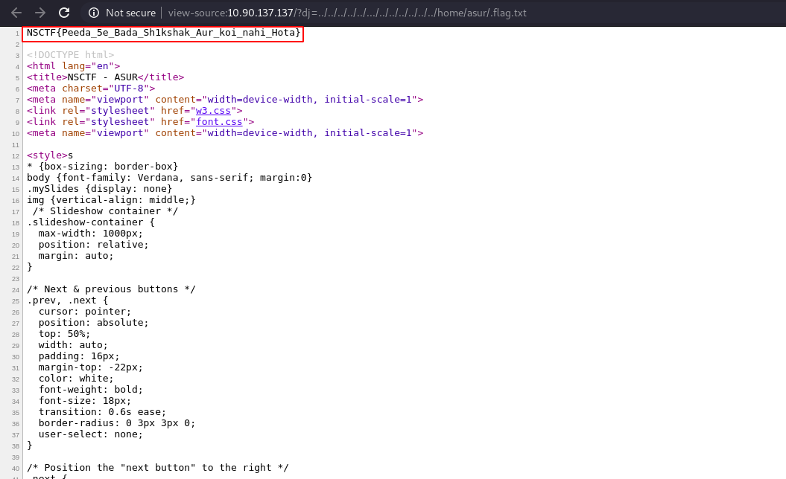

* **`NSCTF{Peeda_5e_Bada_Sh1kshak_Aur_koi_nahi_Hota}`**

<h3>Challenge-4</h3>

**Hints :**
* Atith me Jao...

**Flag 4 :** 50 Points

**Description :**

* From the hint i got the idea that i have to check asur user history so i opened `ash_history` file and i got the path of `backuo_asur.txt` file.

 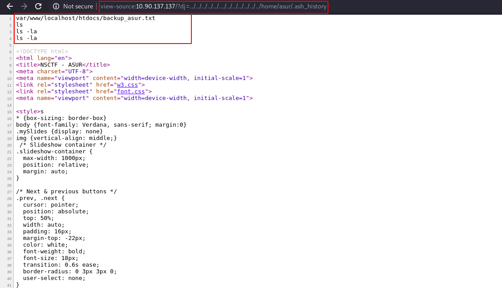

* When i opened that file i got some hash value along with the username `asur`.

 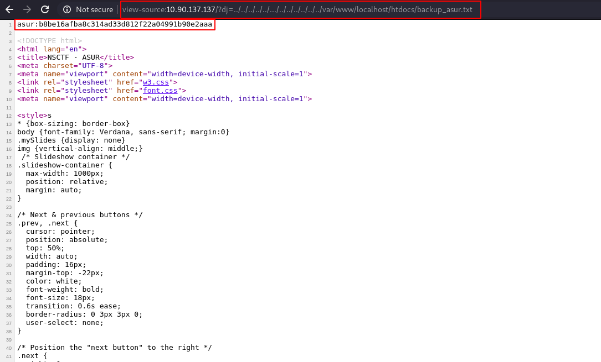

* Then i used online password hash cracker tool to decode that hash value and i got the password `baconancheese`.

 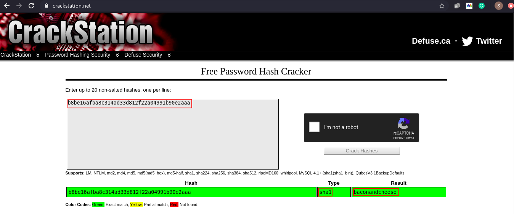

* Then I tried to get ssh connection of the asur user but as you can see the picture i don't have permission.

 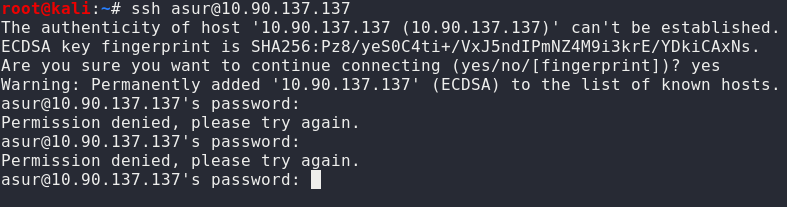

* So again i opened etc file and found another user `shubh`.

 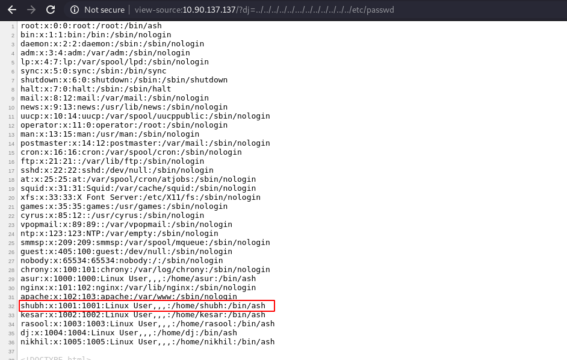

* Then I tried to get ssh connection of the `shubh` user and got the connection.

 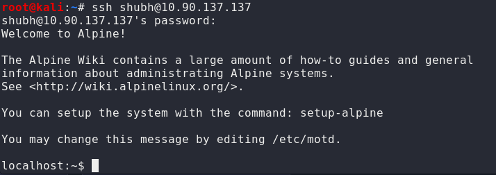

* Then i used following command `ls -la` to list all the files and i found `flag.txt` file from that file i got the fourth flag.

 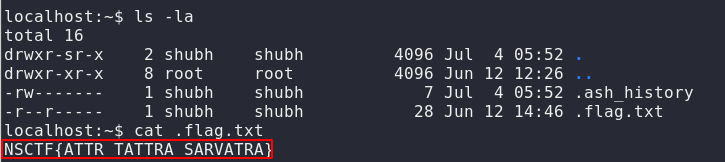

* **`NSCTF{ATTR_TATTRA_SARVATRA}`**

<h3>Challenge-5</h3>

**Hints :**
* Privilege Escalation

**Flag 5 :** 50 Points

**Description :**

* From the hint i got the idea that i have to do privilege escalation for that first i used following command `sudo -l`. As shown in the picture shubh user has the permission to run find command as a root.

 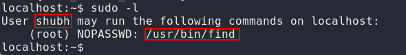

* Then i used following command `sudo find .flag.txt -exec /bin/ash \;` for privilege escalation. As you can see the picture shubh is a root user now.

 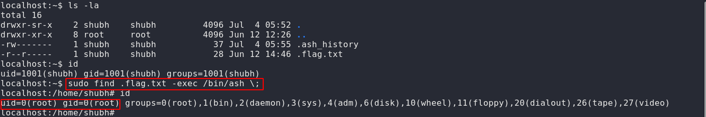

* And from the root directory i found `flag.txt` file and got the fifth flag.

 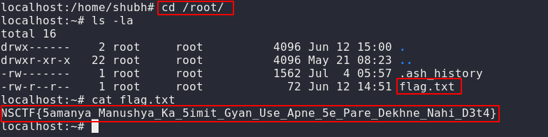

* **`NSCTF{5amanya_Manushya_Ka_5imit_Gyan_Use_Apne_5e_Pare_Dekhne_Nahi_D3t4}`**

-----

**It was a very nice CTF by [Prachi Karad](https://twitter.com/arun_prachi).**

* Here are the scoreboard of CTF. 

 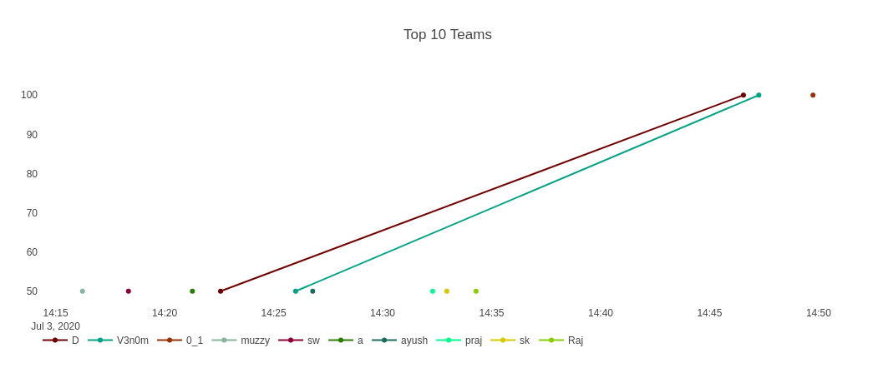

 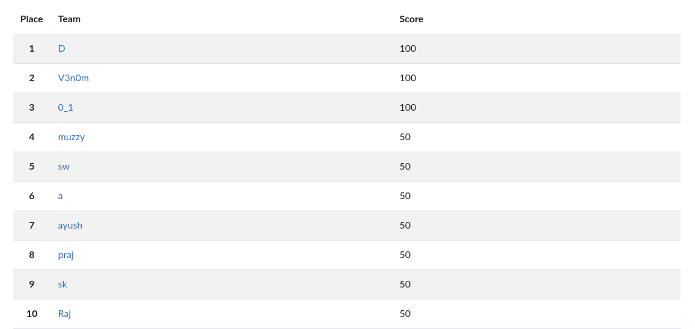